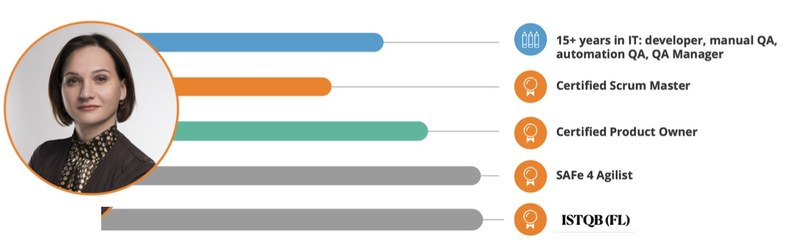

# Maria Akulova   

> ## **Junior Frontend Developer**  
>Waterloo, Brussel  
>  
|**Contacts:** || **Languages:**||  <span style="color:blue" >**Education:**</span>|
|-|-|-|-|-|
|Email: maria.akulova.dragon@gmail.com    | |English - B2 (Epam)||Specialist - Nacional'na Metallurgijna Akademija Ukraini (1994-1999)|
|Phone: +32479407977  | | Ukrainian - Native ||Java Developer - Maharishi Institute of Management (2003-2004)|
| Telegram: [@MariaAkulova ](https://t.me/MariaAkulova)    | | Russian - Native|
|Skype: megaandros8 | | French - A1 (understand small talk)|
|Discort: maria.akulova.dragon | ||
|[LinkedIn Profile ](https://www.linkedin.com/in/maria-akulova-istqb-%D1%81tfl-safe-csm-cspo-96b12220/) |||
||||

|  **Technical Skills highlights**  | **Score**| **Contacts:**  |
| ----------- | ----------- | ----------- |
| JavaScript |     |     |
| HTML5  |     |      |
| CSS3  |    |     |
| Git/GitHub  |     |  |
| Jenkins/TeamCity  |      |    |
| SQL  |     |   |
| Docker |     | |
| SonarQube  |    |    |
| Sentry/Kibana |    |  | 
| Postman  |      |  |
|Jira |     | |
|Confluence |     ||
|Agile |     ||
|Scrum |     ||

> ## **About myself**
>
In the past, I am an experienced QA who has tried herself in different roles. Now I have a new goal - I want to be a creator. A person who can bring new value to the world.


> ## **Code example**
>
**KATA from CODEWARS:Handshake problem**: I like this example because I avoid looping solutions and apply my mathematical knowledge and understanding of the idea of a graph.  
```
function getParticipants(handshakes){
//   relationshipCounter = (x*(x-1))/2 - graph nodes formula
//   x is a count of nodes
//   handshakes - relationshipCounter
//   solution is a roots of quadratic equation
//   formula of quadratic equation: ax2 + bx + c = 0
  if (handshakes == 0) return 0;
  let a = 1;
  let b = -1;
  let c = -2*handshakes;  
  let rootPositive, descriminant;
  
//   root1 is always negative, so ingore 
//   descriminant = b2 - 4ac
  descriminant = b*b-4*a*c;
  rootPositive = (-b + Math.sqrt(descriminant))/2*a;
  return Math.ceil(rootPositive);    
}
```

>## **Courses**
>
- JavaScript Manual on learnjavascript.ru (in progress)
- RS Schools Course «JavaScript/Front-end. Stage 1» (in progress)

> ## **Licenses & certifications**
>


- **Certified Tester, Foundation LevelCertified Tester, Foundation Level**  
ASTQB - ISTQB in the U.S. - Official PageASTQB - ISTQB in the U.S. - Official Page  
Issued Dec 2021Issued Dec 2021  
Credential ID 21-CTFL-02479-USA

- **REST API in testing**  
REST API in testing  
Software-Testing.RuSoftware-Testing.Ru  
Issued Jun 2020    
- **ICAgile Certified Professional (ICP)**  
ICAgileICAgile  
Issued Dec 2018  
- **Certified Scrum Product Owner® (CSPO®)**  
Scrum AllianceScrum Alliance  
Issued Oct 2018 · Expired Oct 2020Issued Oct 2018 · Expired   Oct 2020  
Credential ID 952093  

- **Certified ScrumMaster® (CSM®)**  
Scrum Alliance  
Issued Jul 2018 · Expired Jul 2020  
Credential ID 923276  

- **Certified SAFe® 4 Agilist**    
Scaled Agile, Inc.  
Issued Nov 2018 · Expired Nov 2019  


